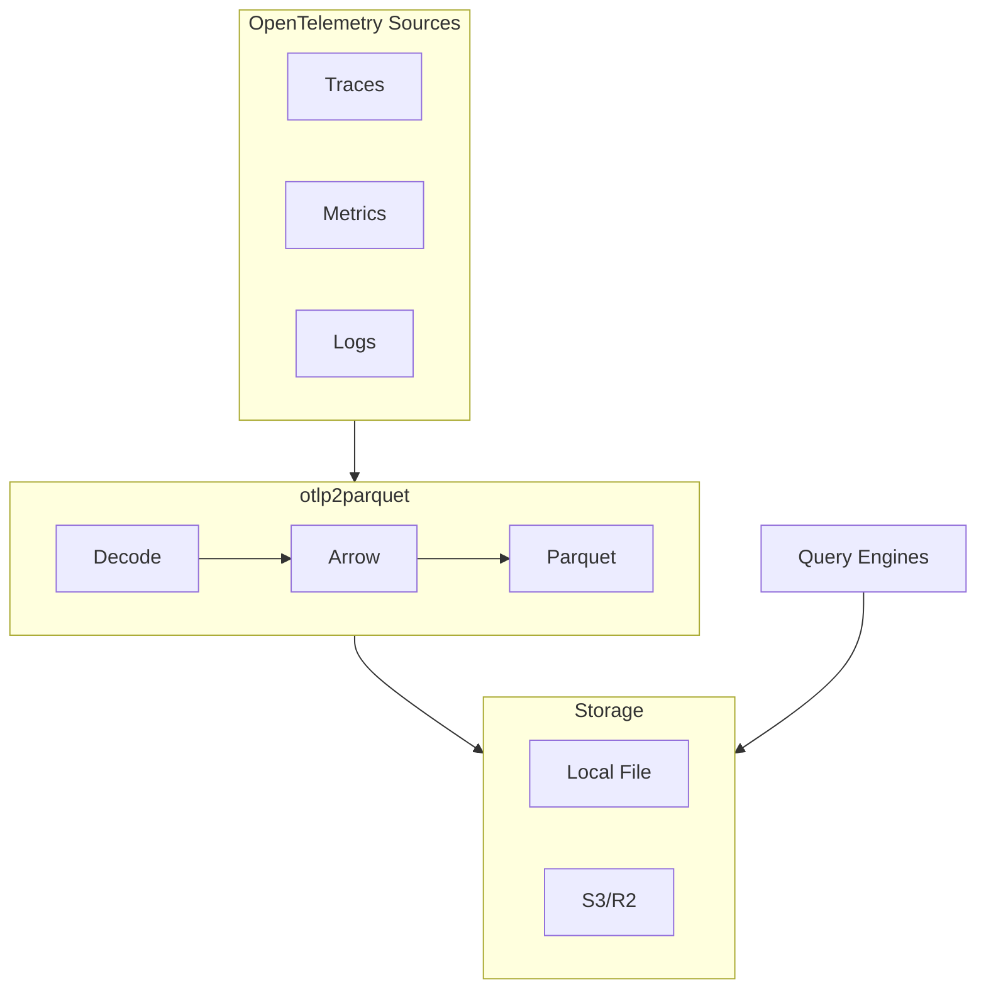

# otlp2parquet

[](https://github.com/smithclay/otlp2parquet/actions/workflows/ci.yml)
[](https://crates.io/crates/otlp2parquet)
[](LICENSE)

> What if your observability data was just a bunch of Parquet files?

Receive OpenTelemetry logs, metrics, and traces and write them as Parquet files to local disk or S3-compatible storage. Query with duckdb, Spark, pandas, or anything that reads Parquet.

If you want to stream observability data to an Apache Iceberg catalog: check out the related [otlp2pipeline](https://github.com/smithclay/otlp2pipeline) project.



## Quick Start

See [Deploy to Cloud](#deploy-to-the-cloud) for running in an AWS Lambda or Cloudflare Worker.

```bash
# requires rust toolchain: `curl https://sh.rustup.rs -sSf | sh`
cargo install otlp2parquet

otlp2parquet
```

Server starts on `http://localhost:4318`. Send a simple OTLP HTTP log:

```bash
curl -X POST http://localhost:4318/v1/logs \
  -H "Content-Type: application/json" \
  -d '{"resourceLogs":[{"scopeLogs":[{"logRecords":[{"body":{"stringValue":"hello world"}}]}]}]}'
```

Query it:

```bash
# see https://duckdb.org/install
duckdb -c "SELECT * FROM './data/logs/**/*.parquet'"
```

Print configuration to receive OTLP from a collector, Claude Code, or Codex:

```bash
otlp2parquet connect otel-collector
otlp2parquet connect claude-Code
otlp2parquet connect codex
```

## Why?

- **Keep monitoring data around a long time** Parquet on S3 can be 90% cheaper than large monitoring vendors for long-term analytics.
- **Query with good tools** — duckDB, Spark, Athena, Trino, Pandas
- **Deploy anywhere** — Local binary, Cloudflare Workers (WASM), AWS Lambda. In basic testing, converting to Parquet with a Lambda or Worker costs around $0.01 to $0.02 per uncompressed GB of log data in compute.

## Deploy to the Cloud

Once you've kicked the tires locally, deploy to serverless:

**Cloudflare Workers + R2 with [wrangler](https://developers.cloudflare.com/workers/wrangler/install-and-update/) CLI:**
```bash
# Generates config for workers
otlp2parquet create cloudflare

# Deploy to Cloudflare
wrangler deploy
```

**AWS Lambda + S3 with [AWS CLI](https://aws.amazon.com/cli/):**
```bash
# Generates a Cloudformation template for Lambda + S3
otlp2parquet create aws

# Deploy with Cloudformation
aws cloudformation deploy --template-file template.yaml --stack-name otlp2parquet --capabilities CAPABILITY_IAM

# Send a log (requires IAM sigv4 auth by default)
uvx awscurl \
  --service lambda \
  --region $AWS_REGION \
  -X POST $FUNCTION_URL \
  -H "Content-Type: application/json" \
  -d '{"resourceLogs":[{"scopeLogs":[{"logRecords":[{"body":{"stringValue":"hello world"}}]}]}]}'
```

Both commands walk you through setup and generate the config files you need.

## Supported Signals

Logs, Metrics, Traces via OTLP/HTTP (protobuf or JSON, gzip compression supported). No gRPC support for now.


## APIs, schemas, and partition layout
- OTLP/HTTP endpoints: `/v1/logs`, `/v1/metrics`, `/v1/traces` (protobuf or JSON; gzip supported)
- Partition layout: `logs/{service}/year=.../hour=.../{ts}-{uuid}.parquet`, `metrics/{type}/{service}/...`, `traces/{service}/...`
- Storage: filesystem, S3, or R2
- Schemas: ClickHouse-compatible, PascalCase columns; five metric schemas (Gauge, Sum, Histogram, ExponentialHistogram, Summary)
- Error model: HTTP 400 on invalid input/too large; 5xx on conversion/storage

## Future work (contributions welcome)
- OpenTelemetry Arrow alignment
- Additional platforms: Azure Functions; Kubernetes manifests


## Learn More

- [Sending data from your app](https://smithclay.github.io/otlp2parquet/sending-data/)
- [Querying Parquet files](https://smithclay.github.io/otlp2parquet/querying/)
- [Configuration reference](https://smithclay.github.io/otlp2parquet/reference/)
- [Full deployment guide](https://smithclay.github.io/otlp2parquet/deploying/)

---

<details>
<summary>Caveats</summary>

- **Batching**: Use an OTel Collector upstream to batch. There is experimental batching support available in the Cloudflare Worker implementation.
- **Schema**: Uses ClickHouse-compatible column names. Will converge with OTel Arrow (OTAP) when it stabilizes.
- **Status**: Functional but evolving. API may change.

</details>
