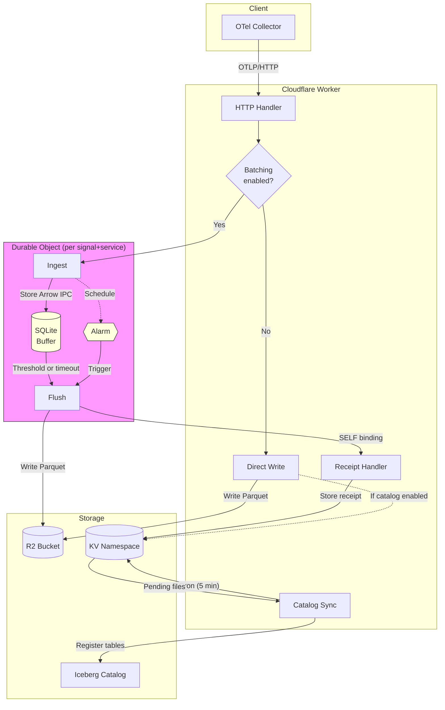

# Deploy

Deploy otlp2parquet to Cloudflare Workers, AWS Lambda, or run locally with Docker.

## Prerequisites

Install the CLI:

```bash
cargo install otlp2parquet
```

Or download from [GitHub Releases](https://github.com/smithclay/otlp2parquet/releases).

---

## Cloudflare Workers

Deploy to Cloudflare's edge network with R2 storage.

### Quick Start

```bash
otlp2parquet deploy cloudflare
```

The wizard prompts for:
- **Worker name** (default: auto-generated like `swift-beacon-4821`)
- **R2 bucket name**
- **Cloudflare Account ID**
- **Catalog mode** - Plain Parquet or Iceberg (R2 Data Catalog)

Then follow the output:

```bash
# 1. Create bucket
wrangler r2 bucket create my-bucket

# 2. Set secrets
wrangler secret put AWS_ACCESS_KEY_ID
wrangler secret put AWS_SECRET_ACCESS_KEY

# 3. Deploy
wrangler deploy
```

If using Iceberg catalog:
```bash
# Create KV namespace for pending file tracking
wrangler kv:namespace create PENDING_FILES
# Update wrangler.toml with the namespace ID
```

### Send test data

```bash
curl -X POST https://your-worker.workers.dev/v1/logs \
  -H "Content-Type: application/json" \
  -d '{"resourceLogs":[{"resource":{},"scopeLogs":[{"scope":{},"logRecords":[{"body":{"stringValue":"Hello"}}]}]}]}'
```

??? note "Non-interactive mode (CI/CD)"
    ```bash
    otlp2parquet deploy cloudflare \
      --worker-name my-worker \
      --bucket my-logs \
      --account-id abc123def456... \
      --catalog none \
      --force
    ```

??? note "Manual setup"
    If you prefer to create `wrangler.toml` manually, see the [generated template](https://github.com/smithclay/otlp2parquet/blob/main/crates/otlp2parquet-cli/templates/wrangler.toml) for reference.

??? warning "Production considerations"
    - **Authentication**: Enable `OTLP2PARQUET_BASIC_AUTH_ENABLED` or add Cloudflare Access
    - **Batching**: Use an OTel Collector upstream to batch requests
    - **Binary size**: Current WASM is ~1.3MB (limit 3MB)
    - **Memory limit**: WASM has ~128MB memory; batches over 48MB are rejected. Split large payloads upstream.

---

### Architecture



??? info "How it works"
    **Without batching (default):**

    - Worker receives OTLP request
    - Immediately converts to Parquet and writes to R2
    - If catalog enabled, stores receipt in KV for later sync

    **With batching enabled:**

    - Worker routes request to Durable Object (DO) based on signal type + service name
    - DO buffers Arrow IPC batches in SQLite (survives hibernation)
    - Flushes to R2 when row count or age threshold is exceeded
    - After R2 write, DO calls back to Worker via `SELF` binding to store KV receipt
    - Cron trigger runs every 5 minutes to sync pending files to Iceberg catalog

    **Why DOs can't write KV directly:**

    Cloudflare Durable Objects cannot access KV bindings (platform limitation).
    The `SELF` service binding allows the DO to call back to the main Worker,
    which has KV access.

??? note "Batching configuration"
    Enable batching with environment variables:

    | Variable | Default | Description |
    |----------|---------|-------------|
    | `OTLP2PARQUET_BATCHING_ENABLED` | `false` | Enable DO batching |
    | `OTLP2PARQUET_BATCH_MAX_ROWS` | `50000` | Flush after N rows |
    | `OTLP2PARQUET_BATCH_MAX_AGE_SECS` | `60` | Flush after N seconds |
    | `OTLP2PARQUET_BATCH_MAX_BYTES` | `10485760` | Flush after N bytes |

    Batching is recommended for high-throughput scenarios to reduce R2 write operations
    and create larger, more efficient Parquet files.

??? info "Dead-letter queue recovery"
    If R2 writes fail after 5 retries, data is preserved in a dead-letter queue at
    `failed/{signal}/{service}/{timestamp}.ipc`. These files contain Arrow IPC batches
    in a custom format (`OTLPIPC1` magic header). To recover, list files with
    `aws s3 ls s3://bucket/failed/`, then deserialize using Arrow IPC and rewrite as Parquet.

## AWS Lambda

Deploy to AWS Lambda with S3 or S3 Tables (Iceberg) storage.

### Quick Start

```bash
# Generates a CloudFormation template for Lambda + S3
otlp2parquet deploy aws

# Deploy with CloudFormation
aws cloudformation deploy --template-file template.yaml --stack-name otlp2parquet --capabilities CAPABILITY_IAM
```

The wizard prompts for:
- **Stack name** (default: auto-generated like `swift-beacon-4821`)
- **Data bucket name** - where Parquet files are written
- **Catalog mode** - Plain Parquet (S3) or Iceberg (S3 Tables)

### Send test data

Lambda URLs use IAM SigV4 auth by default:

```bash
uvx awscurl \
  --service lambda \
  --region $AWS_REGION \
  -X POST $FUNCTION_URL/v1/logs \
  -H "Content-Type: application/json" \
  -d '{"resourceLogs":[{"scopeLogs":[{"logRecords":[{"body":{"stringValue":"hello world"}}]}]}]}'
```

### Get your endpoint

```bash
aws cloudformation describe-stacks \
  --stack-name otlp2parquet \
  --query 'Stacks[0].Outputs[?OutputKey==`FunctionUrl`].OutputValue' \
  --output text
```

??? note "Non-interactive mode (CI/CD)"
    ```bash
    otlp2parquet deploy aws \
      --stack-name my-stack \
      --bucket my-data \
      --catalog none \
      --force

    aws cloudformation deploy --template-file template.yaml --stack-name my-stack --capabilities CAPABILITY_IAM
    ```

??? note "Custom Lambda binary"
    To use a custom build instead of GitHub Releases:
    ```bash
    # Build the Lambda binary
    make build-lambda

    # Upload to your bucket
    aws s3 cp target/lambda/bootstrap-arm64.zip s3://my-bucket/

    # Generate template with custom S3 URI
    otlp2parquet deploy aws --lambda-s3-uri s3://my-bucket/bootstrap-arm64.zip
    ```

??? warning "Production considerations"
    - **Authentication**: Lambda URL uses IAM auth by default (SigV4)
    - **Cold starts**: First invocation takes ~1s; configure retries in OTel exporter
    - **Batching**: Use an OTel Collector to batch requests and reduce invocations

---

## Docker (Local / Self-Hosted)

Run locally for development or self-host in your infrastructure.

### Quick Start

```bash
docker-compose up
```

This starts:
- **otlp2parquet** on port 4318
- **MinIO** (S3-compatible storage) on ports 9000/9001

### Send test data

```bash
curl -X POST http://localhost:4318/v1/logs \
  -H "Content-Type: application/json" \
  -d '{"resourceLogs":[{"resource":{},"scopeLogs":[{"scope":{},"logRecords":[{"body":{"stringValue":"Hello"}}]}]}]}'
```

### Verify output

Open MinIO Console at `http://localhost:9001` (login: `minioadmin`/`minioadmin`).

??? note "Production with cloud storage"
    Point Docker at real S3/R2 instead of MinIO:
    ```bash
    OTLP2PARQUET_STORAGE_BACKEND=s3 \
    OTLP2PARQUET_S3_BUCKET=my-prod-bucket \
    OTLP2PARQUET_S3_REGION=us-west-2 \
    docker-compose up
    ```

??? note "Common commands"
    - View logs: `docker-compose logs -f otlp2parquet`
    - Reset data: `docker-compose down -v`
    - Rebuild: `docker-compose up --build`
